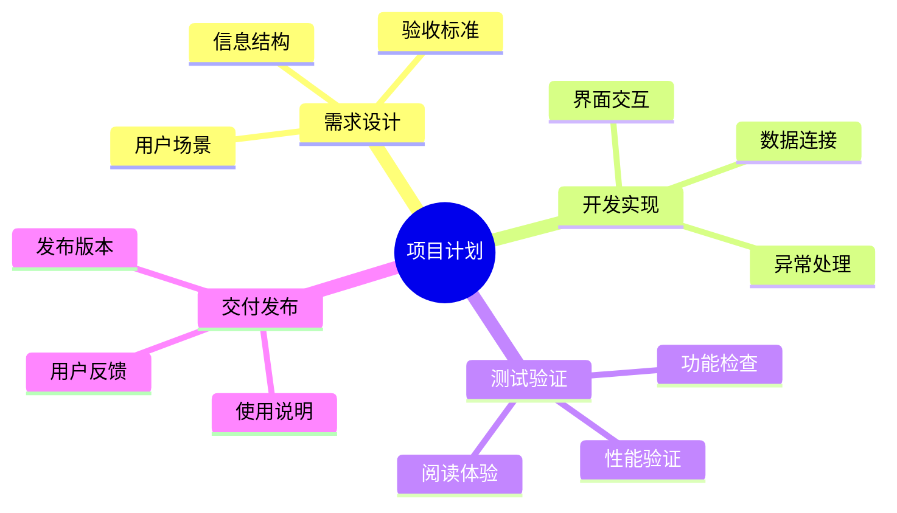
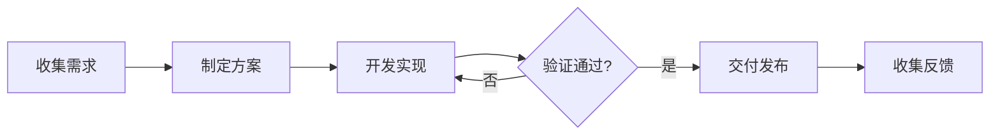
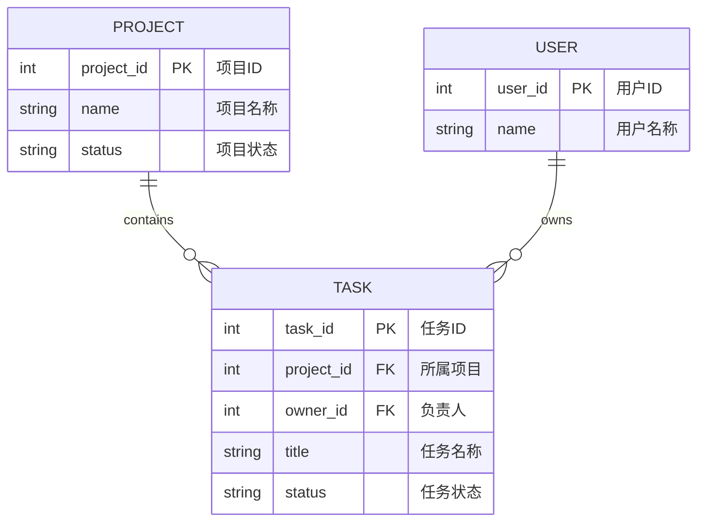

# 示例

在 Obsidian 阅读模式或实时预览中查看以下代码块。

## 项目计划脑图

```mermaid
mindmap
  root((项目计划))
    需求设计
      用户场景
      信息结构
      验收标准
    开发实现
      界面交互
      数据连接
      异常处理
    测试验证
      功能检查
      阅读体验
      性能验证
    交付发布
      使用说明
      发布版本
      用户反馈
```

## 工作流程

```mermaid
flowchart LR
  A[收集需求] --> B[制定方案]
  B --> C[开发实现]
  C --> D{验证通过?}
  D -->|是| E[交付发布]
  D -->|否| C
  E --> F[收集反馈]
```

## 数据关系

```mermaid
erDiagram
  PROJECT ||--o{ TASK : contains
  USER ||--o{ TASK : owns
  PROJECT {
    int project_id PK "项目ID"
    string name "项目名称"
    string status "项目状态"
  }
  TASK {
    int task_id PK "任务ID"
    int project_id FK "所属项目"
    int owner_id FK "负责人"
    string title "任务名称"
    string status "任务状态"
  }
  USER {
    int user_id PK "用户ID"
    string name "用户名称"
  }
```
